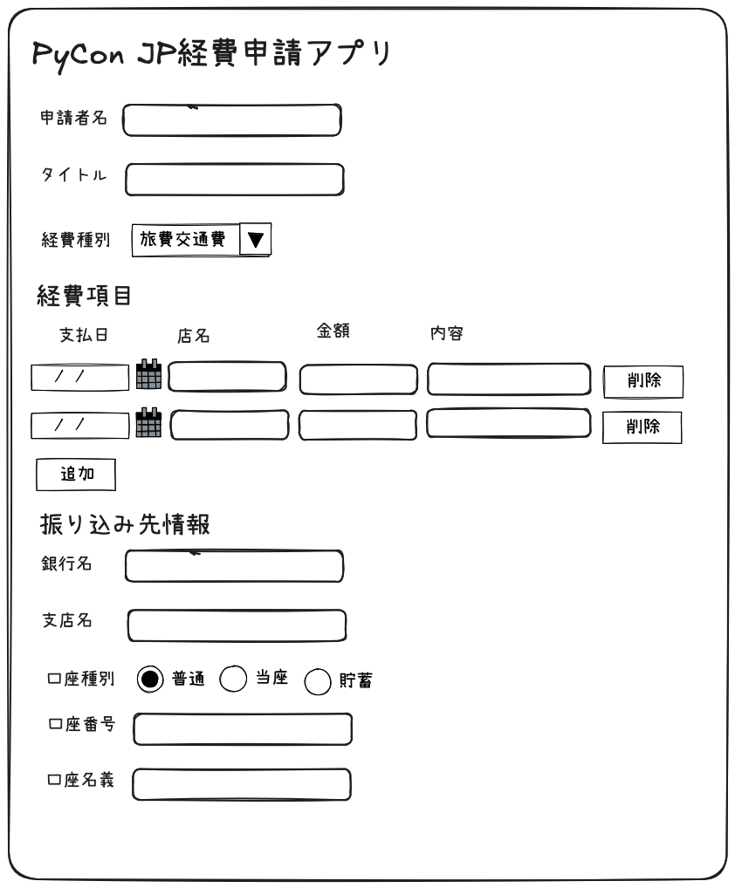

# pyconjptv-expense-app
PyCon JP TVで作成する経費申請アプリ

## 目的

PyCon JP AssociationではPyCon JPイベントやPython Boot Campなどさまざまなイベントを運営している。
そのイベント運営の中で理事や運営メンバー、イベントの主催メンバーはさまざまなものを経費で購入する。
経費申請はJIRAチケットを作成して行っているが、入力項目が多いため入力がしにくい、またミスが発生しやすい。

上記の課題を解決するために、PyCon JP関係者が使用する経費申請アプリ(pyconjptv-expense-app)を作成する。

## 機能概要

* ユーザー（PyCon JP関係者）が経費申請アプリのフォームに必要事項を入力、レシート画像をアップロードする
* 経費申請アプリは入力された情報が適切か、必須項目に漏れがないかをチェックする
* 入力内容に漏れがなければ、入力された内容を元にJIRAの経費申請チケットを作成する

## 入力項目とその仕様

* 経費申請アプリでは以下の項目が入力できる

## 開発環境 (uv 仮想環境)

このリポジトリでは `uv` という名前のPython仮想環境を使った手順を記載します。macOS の `zsh` を想定しています。

セットアップ手順:

```bash
# 1. 仮想環境を作成（venv を使用）
python3 -m venv uv

# 2. 仮想環境を有効化
source uv/bin/activate

# 3. 依存関係をインストール（`pyproject.toml` ベース）
# setuptools を使ってローカルパッケージとしてインストールします。
pip install -e .
```

## アプリの起動

仮想環境を有効化した状態で以下を実行します。

```bash
streamlit run app.py
```

起動後、ブラウザが自動的に開きます。表示されない場合は表示されたローカルURL (通常 `http://localhost:8501`) をブラウザで開いてください。

## 使い方（簡単）

- フォームに日付、カテゴリ、金額、備考を入力して「追加」ボタンを押すと、プロジェクトルートに `expenses.csv` が作成／追記されます。
- "履歴を表示する" にチェックすると、保存された履歴を一覧できます。

## 追加でやること（今後）

- 領収書ファイルのアップロード対応
- 複数経費項目の追加
- JIRA 連携
|項目名|目的|形式|バリデーションルール|
|----|----|----|----|
|申請者名|申請者の名前。将来的にはGoogleアカウントで認証し、メールアドレスから自動で申請できるようにしたい|テキスト入力|必須|
|タイトル|経費申請が何に関する物かを表すタイトル。JIRAのチケット名に使用される（例：Python Boot Camp in北九州の旅費・交通費）|テキスト入力|必須|
|経費種別|経費の種類をあらかじめ用意された選択肢から選択。選択肢は「旅費交通費、消耗品費、交際費、雑費」|プルダルンまたはラジオボタン|必須|
|経費項目|1件以上の経費項目を入力する。詳細は別表を参照|表形式|必須|
|添付ファイル|領収書やレシートの画像をアップロードする。複数ファイルのアップロードが可能だとうれしい|アフィルアップロード|必須、ファイル形式はPDF、JPEG、PNGのいずれか|
|銀行名|振り込み先の銀行名|テキスト入力|必須|
|支店名|銀行の支店名|テキスト入力|必須|
|口座種別|普通、当座、貯蓄から選択。デフォルト値は普通|ラジオボタン|必須|
|口座番号|振り込み口座の口座番号|テキスト入力|必須、数字のみ入力可、7桁以上|
|口座名義|振り込み口座の名義人の名前|テキスト入力|必須|

### 経費項目

* 経費項目は領収書やレシート1枚ごとに1件入力する
* 目的が同一であれば、複数の領収書をまとめて1回の経費申請として入力できる（例：Python Boot Campの移動のJRとホテル代）

|項目名|目的|形式|バリデーションルール|
|----|----|----|----|
|支払日|支払った日付を指定する|日付ピッカー|必須|
|店名|支払った店名を記入する|テキスト入力|必須|
|金額|税込みの金額を記入する|テキスト入力|必須、1以上の整数のみ|
|内容|項目の詳細について説明する場合に追記する（◯◯ホテル代等）|テキスト入力| |

## 入力画面イメージ



## 出力項目とその仕様

この段階では入力したデータを辞書またはdataclass等に保存し、コマンドライン等に出力するのみでOK。
確認のためにJSON等でファイル保存をしてもよい。

添付ファイルは複数存在するので、ファイル保存する場合は、申請単位でフォルダを作成し(日時を使う)、そのフォルダの下に添付ファイル一式とJSONを保存する想定。

以下は保存されるデータのJSONのイメージ。

```json
{
  "申請日": "2025-12-20",
  "タイトル": "OSC Fukuoka 2025旅費、宿泊費",
  "経費種別": "旅費交通費",
  "合計金額": 65520,
  "申請者情報": {
    "氏名": "鈴木たかのり",
    "メールアドレス": "takanory@example.com",
    "Slackユーザー名": "@takanory"
  },
  "経費項目リスト": [
    {
      "支払日": "2025-12-10",
      "店名": "ANAツアーズ",
      "金額": 65000,
      "内容": "飛行機往復+ホテル",
    },
    {
      "支払日": "2025-12-10",
      "店名": "福岡市地下鉄",
      "金額": 520,
      "内容": "空港、博多駅往復",
    }
  ],
  "振込先口座情報": {
    "銀行名": "パイソン銀行",
    "支店名": "蛇の目支店",
    "口座種別": "普通",
    "口座番号": "1234567",
    "口座名義（カナ）": "スズキ タカノリ"
  }
}
```
